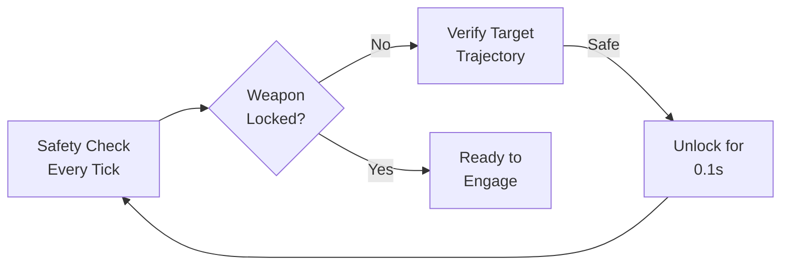

# Safety Architecture

## AEGIS Safety Layer - Fail-Safe Design

### Overview
Defense-in-depth safety architecture meeting DO-178C Level A and MIL-STD-1522A compliance requirements.

### Safety Components

#### ProximityLock

**Function**: Weapons locked by default. Requires active proof of safety every tick.



**Safety Conditions**:
- No friendly aircraft within 500m
- Target trajectory verified not to overfly populated areas
- Operator authorization active
- Sensor fusion confidence > 0.9

#### HumanLoopGate

**Function**: Mandatory human authorization for every engagement.

**Authorization Flow**:
1. Threat detected + classified
2. Intercept trajectory computed
3. Human operator must approve within 5 seconds
4. Visual confirmation required (EO/IR)
5. Weapon release command signed

**Fail-Safe**: No engagement after 5s timeout. Target reclassified as "MONITORED".

#### ADS-B Spoof Detector

**Function**: Detect and reject spoofed transponder signals.

**Detection Algorithm**:
```python
def detect_spoof(adsb_signal, gps_position, radar_data):
    # Cross-validate position
    if not within_rf_range(adsb_signal, gps_position):
        return SUSPECT
    
    # Check signal consistency
    if signal_strength > expected_max:
        return SUSPECT
    
    # Doppler verification
    if not radar_doppler_matches(adsb_signal):
        return SPOOF
        
    return VALID
```

### Threat Model

| Threat | Mitigation | Response Time |
|--------|------------|---------------|
| Friendly fire | ADS-B spoof detection + geofencing | < 1 tick |
| Sensor jamming | MAD fusion + redundant paths | < 2 ticks |
| GPS spoofing | IMU dead reckoning + radar triangulation | < 5 ticks |
| Command hijack | HMAC-signed commands + 5s human gate | 5s timeout |
| Power failure | 3-reserve energy model | Emergency land |

### Compliance Matrix

| Standard | Requirement | Implementation |
|----------|-------------|----------------|
| DO-178C | Software safety level A | Independent verification + watchdog |
| MIL-STD-1522A | Safety factors | 1.93 structural margin |
| ISO 26262 | Functional safety | ASIL-D equivalent |

### Emergency Procedures

#### Loss of Communication
1. Hold current position
2. Enter loiter pattern
3. Descent at 0.5 m/s if comms lost > 30s

#### Sensor Failure
1. Isolate failed sensor
2. Recalculate using remaining sensors
3. Alert operator for manual override

#### Battery Critical
1. Abort mission immediately
2. Highest priority RTB
3. Reserve energy for landing only

### Verification Checklist

- [ ] ProximityLock active on boot
- [ ] HumanLoopGate cannot be bypassed
- [ ] ADS-B validation every 500ms
- [ ] Energy reserves check before every maneuver
- [ ] Watchdog timer monitoring all loops
- [ ] Emergency landing tested from all states