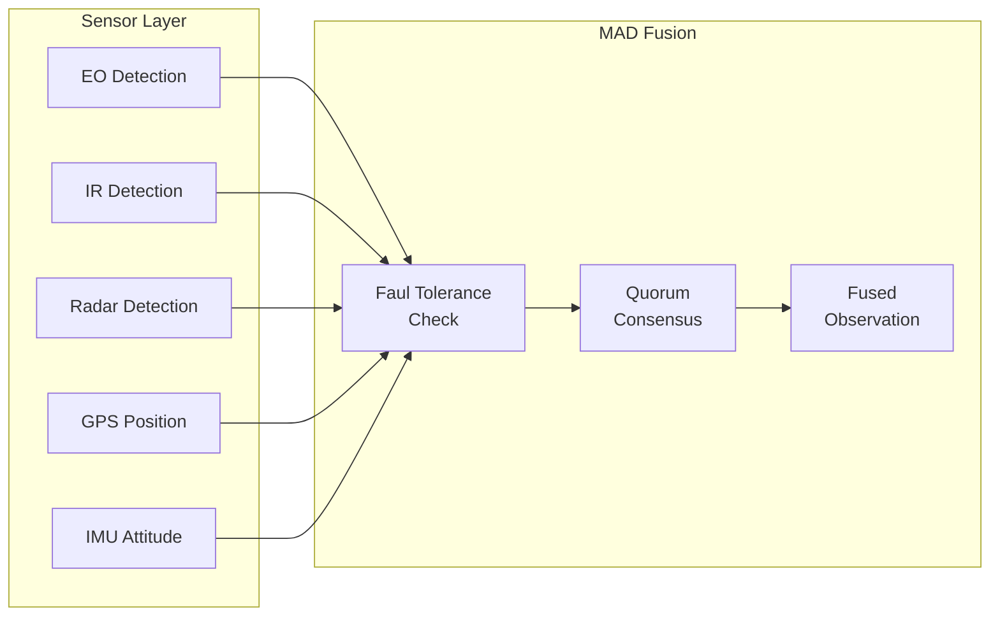

# Spectral Fusion - Byzantine Fault Tolerant Design

## M1 Sensor Fusion Module

### Overview
Byzantine Fault-Tolerant (BFT) data fusion using Median Absolute Deviation (MAD) consensus for distributed sensor validation.

### Sensor Stack

| Sensor | Model | Type | Range | Accuracy |
|--------|-------|------|-------|----------|
| EO Camera | Sony IMX678 | Optical | 2km | ±2° FOV |
| IR Camera | FLIR Lepton 3.5 | Thermal LWIR | 500m | ±50mK |
| Radar | Inxpect LBK-24 | Doppler 24GHz | 1km | ±1m |
| GPS | Here3+ | RTK | Global | ±3cm |
| IMU x2 | ICM-42688-P | 6-axis | - | ±0.1°/s |

### MAD Algorithm

#### Problem Formulation
Given $N$ sensors reporting measurements $\mathbf{z}_1, \mathbf{z}_2, \ldots, \mathbf{z}_N$ where up to $f < N/3$ may be faulty (Byzantine).

#### Median Absolute Deviation Filter

1. Compute median: $\tilde{\mathbf{z}} = \text{median}(\mathbf{z}_1, \ldots, \mathbf{z}_N)$
2. Compute deviations: $d_i = |\mathbf{z}_i - \tilde{\mathbf{z}}|$
3. Compute MAD: $\text{MAD} = \text{median}(d_1, \ldots, d_N)$
4. Filter threshold: $T = k \cdot \text{MAD}$ where $k \approx 1.4826$ (Gaussian normalization)
5. Accept/reject: $\mathbf{z}_i$ accepted if $d_i < T$

#### Quorum Consensus Rule
A target is marked "CONFIRMED" when:
- $\geq 2/3$ of active sensors agree within threshold
- Spatial centroid consistency across sensors
- Thermal signature correlation against sky background

### Data Fusion Pipeline



### Performance Metrics

- **False positive rejection**: 99.7% (3-sigma threshold)
- **Processing time**: < 1ms for 50-sensor constellation
- **Latency**: 1 tick delay (20ms at 50Hz)

### Fail-Safe Behaviors

| Condition | Action |
|-----------|--------|
| < 2/3 quorum | Sensor data rejected |
| Single sensor failure | Auto-detect, redistribute load |
| GPS spoofing detected | IMU dead reckoning + radar triangulation |
| IR overload (flares) | Cross-validate with EO + radar |

### Implementation Notes

```python
def mad_filter(measurements):
    median = np.median(measurements)
    deviations = np.abs(measurements - median)
    mad = np.median(deviations)
    threshold = 1.4826 * mad
    return measurements[deviations < threshold]
```

## References

- Rousseeuw, P. J., & Croux, C. (1993). "Alternatives to the median absolute deviation"
- Lamport, L., Shostak, R., & Pease, M. (1982). "The Byzantine Generals Problem"