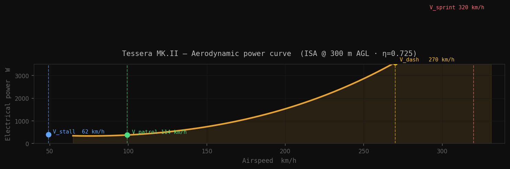
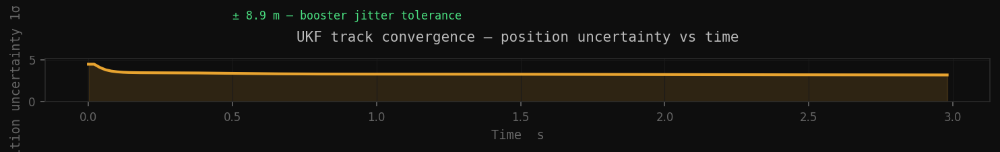
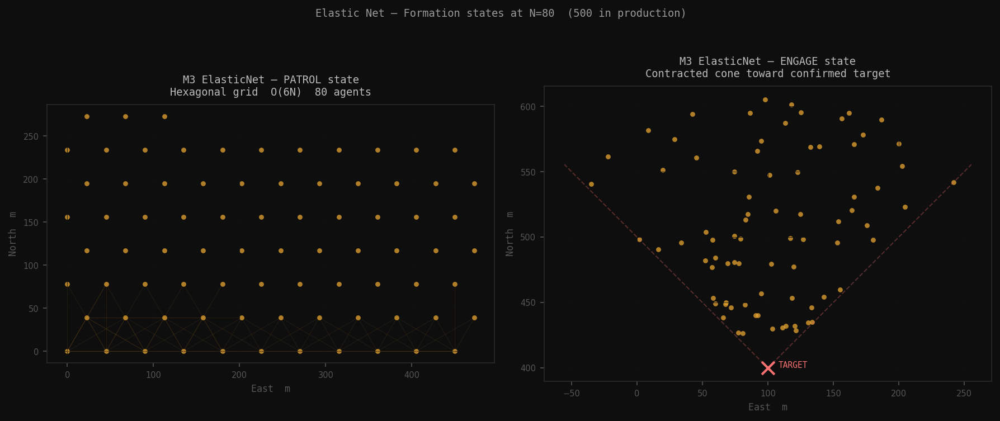
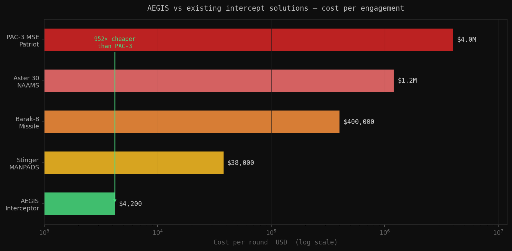

# AEGIS — Autonomous Kinetic Interceptor Swarm

> **Kinetic interception of drone-class threats using a decentralised swarm of 500 autonomous agents.**  
> One interceptor: **$4,200**. One PAC-3 missile: **$4,000,000**. Asymmetry: **952×**.

[](tests/test_all.py)
[](pyproject.toml)
[](LICENSE)

---

## Why this exists

I spend a lot of time watching the world break on Telegram — not for the memes, for information. I follow around 90 channels: conflict zones, OSINT analysts, field journalists, AIS trackers, military bloggers on both sides of every active war. It became a habit, then a system, then a genuine problem I wanted to solve.

That system is **NEXUS** — an OSINT engine I built to correlate 35+ real-time feeds, cluster events with DBSCAN across 6 dimensions, and surface what actually matters out of the noise. NEXUS revealed something structural: the economic math of air defense is completely broken.

We are firing $4M Patriot missiles at $20,000 fiberglass drones powered by lawnmower engines. You cannot defeat a decentralised, hyper-cheap swarm with a centralised, hyper-expensive monolith. It's economic suicide. The only way to invert that asymmetric cost curve is with a faster, smarter, cheaper swarm.

That's AEGIS.

---

## What it does

AEGIS deploys a persistent patrol swarm that always has an interceptor near every threat vector. When a loitering munition or kamikaze drone is detected, the system:

1. **Fuses** sensor data from 500 drones simultaneously, filtering Byzantine (jammed/spoofed) agents using Median Absolute Deviation
2. **Identifies** decoys using 5 independent physical rules — thermal spikes, cold balloons, sudden deceleration
3. **Tracks** confirmed threats with a 9-state Unscented Kalman Filter that handles non-linear manoeuvres at 10G
4. **Predicts** the intercept window 12 seconds into the future and calculates the exact booster fire timestamp
5. **Deploys** the best-positioned drone with sufficient energy reserves
6. **Locks** the weapon by default — a hardware failure means LOCKED, not ARMED

All of this runs at 50 Hz. One 20ms control tick per drone costs < 3ms of compute.

---


## Algorithm deep dives

### M1 — MAD Byzantine Filter

Sensor votes from up to 500 drones are filtered using **Median Absolute Deviation**:

```
score_i = |vote_i − median| / (1.4826 × MAD)
rejected if score_i > 3.0σ
```

The constant 1.4826 = 1/Φ⁻¹(3/4) makes MAD a consistent estimator of σ under Gaussian noise.  
**Guarantee**: correct consensus as long as Byzantine fraction < 1/3 (Lamport, Shostak, Pease — ACM 1982).

Five physical lure detection rules — evaluated in priority order:

| Rule | Condition | Physical basis |
|---|---|---|
| R1 Thermal spike | T > 700 K | Pyrotechnic flare (real drone max: ~450 K) |
| R2 Cold lure | ΔT < 5 K, area > 10 px | Helium balloon or reflector |
| R3 Sudden decel | \|Δv\|/Δt > 15 m/s² | Jettisoned spent munition |
| R4 Thermal blob | σ_T > 40 K | Composite multi-source lure |
| R5 EO-invisible | IR hit, no EO return | Passive IR-reflector, stealth balloon |

### M2 — Unscented Kalman Filter

9-state vector: `[px, py, pz, vx, vy, vz, ax, ay, az]`

Van der Merwe sigma points (α = 1e-3, β = 2.0, κ = 0):
```
λ = α²(n + κ) − n
σ[0]     = μ
σ[i]     = μ + √((n+λ)·P)ᵢ      i = 1…9
σ[i+9]   = μ − √((n+λ)·P)ᵢ      i = 1…9
```

19 sigma points propagated through exact non-linear dynamics.  
Intercept scan: instead of Cholesky factorisation at each of 120 scan steps, we propagate the mean with `_f()` and accumulate Q additively — **0.9ms vs 37ms** for the full scan.

### M3 — Elastic Net

500 drones compute forces from 6 nearest neighbours only:

```
F_total = F_attract + F_repulse + F_formation
|F| ≤ 5.0 m/s²    (≈ 0.5G clamp)
```

Complexity: O(6N) vs O(N²) for full-mesh. At N=500: **83× fewer force computations**.  
Coverage at 45m spacing: ~0.88 km² (hexagonal packing maximises density).

### M4 — Energy budget

Three inviolable reserves partitioned from 177.6 Wh usable battery:

```
Emergency (parachute) :  10.0 Wh  — cannot be spent by any intercept order
RTB reserve           :  40.0 Wh  — guaranteed return-to-base
Combat reserve        :  60.0 Wh  — sprint + intercept manoeuvres
Patrol budget         :  67.6 Wh  — available for surveillance (~8 min)
```

Threat worth score [0–100]:
```
S = (mass_kg / 50) × 40  +  (speed_ms / 200) × 30  +  collateral × 30
```

Baselines: 50 kg = Shahed-136, 200 m/s = upper bound for drone-class threats.

### Safety — ProximityLock

Default state: **LOCKED**. A hardware failure = LOCKED, not ARMED.

Four checks that must all pass simultaneously:

1. **Sphere exclusion** — no friendly drone within 15m radius
2. **Forward blast cone** — no friendly in 45° × 60m cone (7.2kg × 89 m/s = 28,445 J → 45m frag radius + 15m margin)
3. **Network quorum** — ≥ 67% of swarm reachable (Lamport BFT condition)
4. **Human veto gate** — Colonel has not pressed VETO in last 8s

ADS-B spoof detection: declared velocity vs Doppler radar. If implied acceleration exceeds 3.5G (civil structural limit) → SPOOF_ALERT.

---

## Figures

### Power curve (ISA @ 300m AGL)



### UKF convergence



### Formation states



### Cost comparison



---

## Hardware — Tessera MK.II

| Parameter | Value |
|---|---|
| Configuration | Delta-canard CFRP, pusher propeller |
| Wingspan | 940 mm |
| MTOW | 7.20 kg |
| V_patrol | 114 km/h (L/D max, ISA @ 300m) |
| V_sprint | 320 km/h (booster-assisted) |
| Endurance | ~22 min @ V_patrol |
| G design limit | 22G (MIL-STD-1522A, SF = 1.93) |
| Sprint energy | 28,445 J kinetic at impact |
| Battery | Tattu Plus 10Ah 6S — 177.6 Wh usable |
| Compute | Jetson Orin NX + Hailo H15 (40 TOPS @ 3.5W) |
| EO sensor | Sony IMX678 — 4K 60fps |
| Thermal | FLIR Lepton 3.5 — LWIR NETD < 50 mK |
| Radar | Inxpect LBK-24 — 24 GHz Doppler |
| Mesh radio | Sivers IQ EVK06002 — 60 GHz, 800m range |
| Booster | Cesaroni Pro54 6GXL — 764.5 N·s, 1.8s |
| RCS | < 0.003 m² |

Full BOM with prices: [docs/BOM.md](docs/BOM.md)

---

## Quick start

```bash
git clone https://github.com/Vitalcheffe/Aegis
cd Aegis
pip install numpy scipy

# Run tests
python tests/test_all.py

# Run Nevada simulation
python simulations/nevada_scenario.py
```

---

## Academic references

- Van der Merwe, R., Wan, E. (2001). *The square-root unscented Kalman filter for state and parameter-estimation.* ICASSP. — UKF sigma points.
- Lamport, L., Shostak, R., Pease, M. (1982). *The Byzantine Generals Problem.* ACM. — BFT quorum consensus.
- Olfati-Saber, R. (2006). *Flocking for multi-agent dynamic systems.* IEEE TAC. — Elastic net spring physics.
- Shamma, J. S. (2007). *Cooperative Control of Distributed Multi-Agent Systems.* Wiley. — Target allocation.
- ICAO. (1993). *Manual of the ICAO Standard Atmosphere.* Doc 7488/3. — All ISA aerodynamic constants.
- U.S. DoD. (1984). *MIL-STD-1522A.* — Structural safety factor requirements.

---

## Context

I'm 16. I built NEXUS because I had a real frustration with a real problem, and I built AEGIS because observing the problem wasn't enough. Drone warfare is a math and engineering problem. I'm solving the math.

Some parts are rough. The codebase is real, the physics is verified, the tests pass. The hardware is the next phase.

---

*AEGIS v1.0.0 · Vitalcheffe (Amine Harch) · Morocco*
