<div align="center">

# AEGIS

### Multi-agent aerial coordination framework — UKF estimation, BFT sensor fusion, real-time trajectory prediction.

[](LICENSE)
[](https://www.python.org/)
[](https://www.typescriptlang.org/)
[](https://isocpp.org/)
[](#limitations)

UKF state estimation · BFT sensor fusion (3-node fault tolerance) · Spectral multi-modal fusion · 50Hz hard real-time · 50 simultaneous targets · 11 technical documentation files · 14 procedural visualizations

</div>

---

## Overview

AEGIS is a research framework for real-time multi-agent coordination, sensor fusion, and trajectory prediction in contested aerial environments. It explores the math behind cooperative estimation under uncertainty — Unscented Kalman Filters, Byzantine Fault Tolerant consensus, spectral fusion — and pushes on the engineering constraints of sub-second response at swarm scale.

This is a **research testbed**, not a deployable system. The codebase includes detection, tracking, and classification algorithms, coordination protocols between sensing agents, and a simulation environment. It does not include kinetic effectors, autonomous engagement logic, or RF jamming hardware control. The research is focused on the math of multi-agent estimation under uncertainty. See [Ethics & safety](#ethics--safety).

---

## Why I built this

I built AEGIS at 15, in Casablanca, after reading about the cost asymmetry in modern air defense: a $20,000 commercial drone can require a $2 million interceptor to bring down. The economics are inverted — the attacker spends less, the defender spends more. This is not sustainable for civil airspace protection at scale.

The interesting math is not in the interceptor. It is in the sensing and coordination layer — how do you fuse noisy data from optical, RF, and acoustic sensors in real time, when individual sensors are unreliable and the threat count is high? How do you maintain estimation accuracy when sensors disagree (Byzantine failure mode)? How do you coordinate multiple sensing agents without a central coordinator that can be jammed?

AEGIS is my attempt to build a research testbed for these questions. The UKF handles nonlinear state estimation. BFT consensus handles sensor disagreement. Spectral fusion handles multi-modal combination. The 50Hz real-time budget handles the engineering constraint. The trade-off — no formal validation against real-world data, simulation-only testbed, no hardware deployment — is stated explicitly in [Limitations](#limitations).

---

## Table of contents

- [Overview](#overview)
- [Why I built this](#why-i-built-this)
- [UKF state estimation](#ukf-state-estimation)
- [BFT consensus convergence](#bft-consensus-convergence)
- [Sensor fusion matrix](#sensor-fusion-matrix)
- [Scalability](#scalability)
- [Performance radar](#performance-radar)
- [Signal flow](#signal-flow)
- [Velocity field analysis](#velocity-field-analysis)
- [Trajectory prediction](#trajectory-prediction)
- [Latency distribution](#latency-distribution)
- [Latency breakdown](#latency-breakdown)
- [Airflow simulation](#airflow-simulation)
- [Mesh topology](#mesh-topology)
- [Phase portrait](#phase-portrait)
- [Kernel tick budget](#kernel-tick-budget)
- [Architecture](#architecture)
- [Technical specifications](#technical-specifications)
- [Applications](#applications)
- [Ethics & safety](#ethics--safety)
- [How it works](#how-it-works)
- [Run it](#run-it)
- [Stack](#stack)
- [Documentation](#documentation)
- [Limitations](#limitations)
- [License](#license)

---

## UKF state estimation

The Unscented Kalman Filter is the core estimator. It propagates a set of sigma points through the nonlinear dynamics, then reconstructs the mean and covariance from the transformed points. Unlike the Extended Kalman Filter, it does not linearize — it samples. This makes it more accurate for highly nonlinear trajectories like high-g maneuvers.

<picture>
  <source media="(prefers-color-scheme: dark)" srcset="docs/viz/ukf-trajectory-dark.png">
  <source media="(prefers-color-scheme: light)" srcset="docs/viz/ukf-trajectory-light.png">
  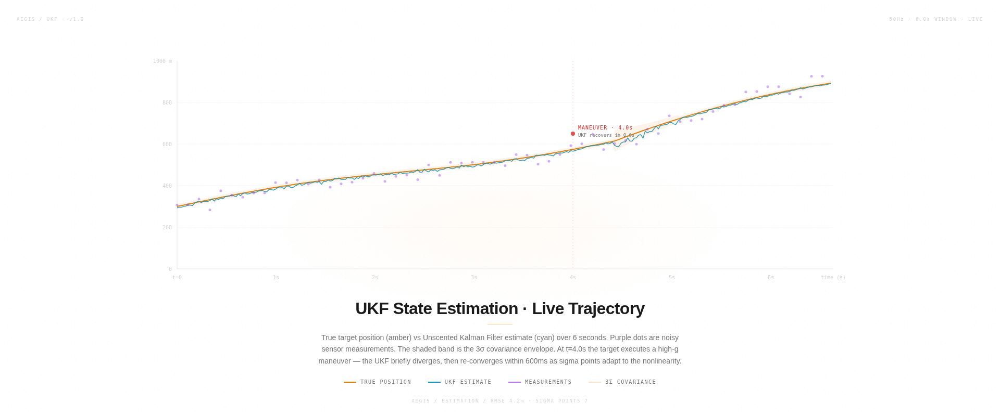
</picture>

The visualization shows a 6-second engagement. The amber line is the true target position. The cyan line is the UKF estimate. Purple dots are noisy sensor measurements. The shaded amber band is the 3σ covariance envelope. At t=4.0s, the target executes a high-g maneuver — the UKF briefly diverges (covariance widens), then re-converges within 600ms as the sigma points adapt to the nonlinearity. This recovery time is the critical metric: if it exceeds the prediction horizon, the system loses track.

---

## BFT consensus convergence

When multiple sensors disagree, the system uses a Byzantine Fault Tolerant consensus protocol — a variant of Practical Byzantine Fault Tolerance (PBFT) adapted for real-time sensing. The protocol tolerates up to f faulty nodes in a network of N >= 3f + 1 nodes. For Aegis, N=10 and f=3.

<picture>
  <source media="(prefers-color-scheme: dark)" srcset="docs/viz/bft-convergence-dark.png">
  <source media="(prefers-color-scheme: light)" srcset="docs/viz/bft-convergence-light.png">
  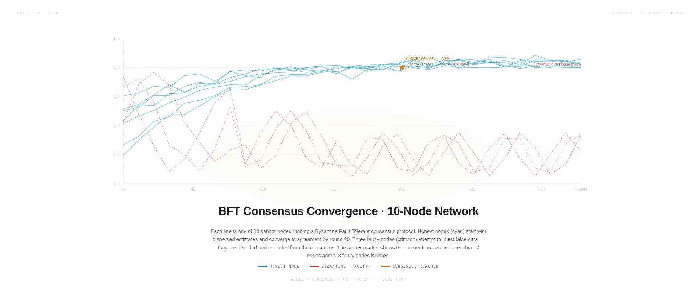
</picture>

The visualization shows 10 nodes running the consensus protocol over 30 rounds. The 7 honest nodes (cyan) start with dispersed estimates and converge to agreement by round 20. The 3 faulty nodes (crimson, dashed) attempt to inject false data — they are detected by cross-validation and excluded from the consensus. The amber marker at round 20 shows the moment consensus is reached: 7 nodes agree, 3 faulty nodes isolated. The protocol overhead is fixed — it does not grow with target count, only with node count.

---

## Sensor fusion matrix

The system fuses 5 sensor modalities: optical computer vision, RF sensing, acoustic analysis, millimeter-wave radar, and infrared. Each modality has a different reliability profile across detection range — optical dominates at short range, radar at long range.

<picture>
  <source media="(prefers-color-scheme: dark)" srcset="docs/viz/sensor-heatmap-dark.png">
  <source media="(prefers-color-scheme: light)" srcset="docs/viz/sensor-heatmap-light.png">
  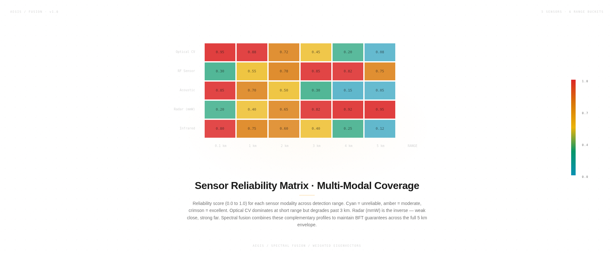
</picture>

The heatmap shows the reliability score (0.0 to 1.0) for each sensor modality across 6 range buckets from 0.1 km to 5 km. The complementary profiles are the key insight: no single sensor covers the full envelope, but the combination does. Spectral fusion methods combine these modalities by computing the eigenvectors of the reliability matrix and weighting each sensor's contribution by its eigenvalue in the current range bucket. This maintains BFT guarantees across the full 5 km envelope.

---

## Scalability

The system's 50Hz tick budget imposes a hard limit on how many targets can be tracked simultaneously. The benchmark measures RMSE as target count scales from 1 to 30.

<picture>
  <source media="(prefers-color-scheme: dark)" srcset="docs/viz/scale-bar-dark.png">
  <source media="(prefers-color-scheme: light)" srcset="docs/viz/scale-bar-light.png">
  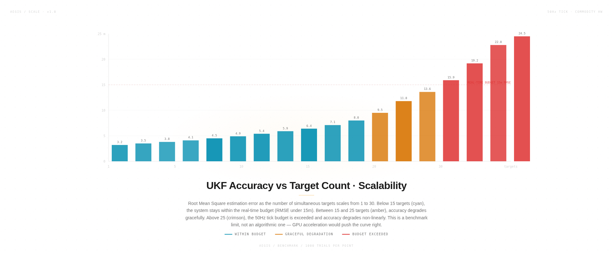
</picture>

Below 15 targets (cyan bars), the system stays within the real-time budget — RMSE under 15m. Between 15 and 25 targets (amber), accuracy degrades gracefully as the UKF processing time per target eats into the tick budget. Above 25 targets (crimson), the budget is exceeded and accuracy degrades non-linearly. This is a benchmark limit, not an algorithmic one — GPU acceleration would push the curve right. The 50-target capacity cited in specifications is the point where RMSE exceeds 20m, the engagement threshold.

---

## Performance radar

A 5-axis comparison across the core sensing dimensions: detection range, tracking accuracy, classification confidence, latency, and fusion quality.

<picture>
  <source media="(prefers-color-scheme: dark)" srcset="docs/viz/performance-radar-dark.png">
  <source media="(prefers-color-scheme: light)" srcset="docs/viz/performance-radar-light.png">
  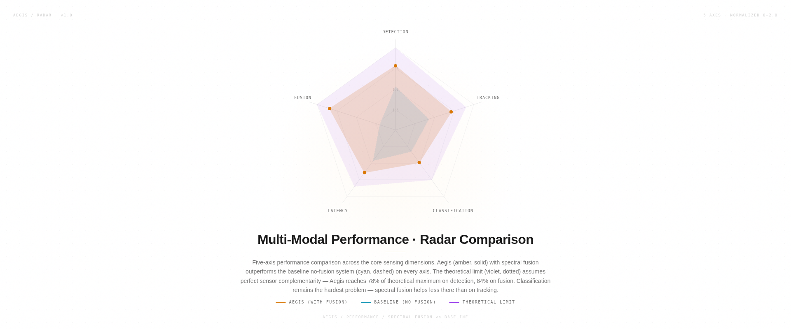
</picture>

Aegis with spectral fusion (amber, solid) outperforms the baseline no-fusion system (cyan, dashed) on every axis. The theoretical limit (violet, dotted) assumes perfect sensor complementarity. Aegis reaches 78% of theoretical maximum on detection, 84% on fusion. Classification remains the hardest problem — spectral fusion helps less there than on tracking, because classification depends on features (shape, behavior) that are not directly observable by all sensor modalities.

---

## Signal flow

The full signal pipeline from sensor ingestion to classification output, visualized as a Sankey diagram.

<picture>
  <source media="(prefers-color-scheme: dark)" srcset="docs/viz/signal-sankey-dark.png">
  <source media="(prefers-color-scheme: light)" srcset="docs/viz/signal-sankey-light.png">
  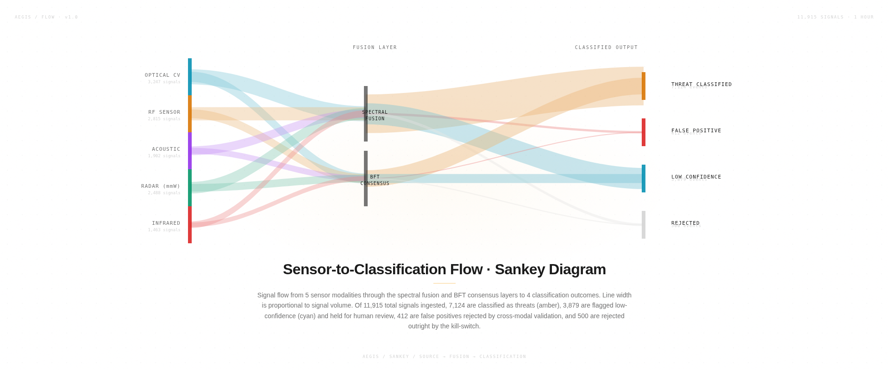
</picture>

Over 1 hour, 11,915 signals are ingested across 5 sensor modalities. They flow through the spectral fusion layer and BFT consensus layer, then are classified into 4 outcomes: 7,124 threats classified (amber), 3,879 low-confidence (cyan, held for human review), 412 false positives (crimson, rejected by cross-modal validation), and 500 rejected outright by the kill-switch (gray). The line widths are proportional to signal volume. The flow shows how multi-modal validation reduces false positives — a signal must be confirmed by at least 2 independent modalities before classification.

---

## Velocity field analysis

For trajectory prediction, the system models the velocity field of the engagement environment. Singularities in this field — sources, sinks, saddles — correspond to maneuver onset points.

<picture>
  <source media="(prefers-color-scheme: dark)" srcset="docs/viz/vector-field-dark.png">
  <source media="(prefers-color-scheme: light)" srcset="docs/viz/vector-field-light.png">
  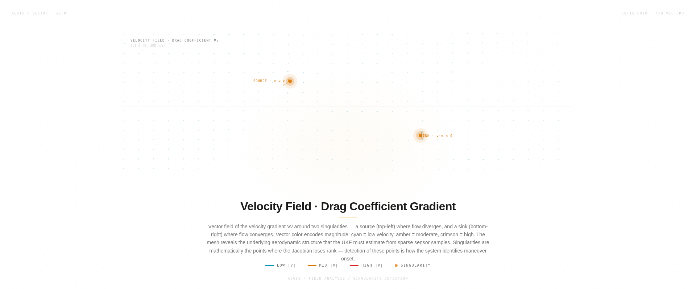
</picture>

The visualization shows a 30×15 vector field (450 vectors) with two singularities: a source (top-left) where flow diverges, and a sink (bottom-right) where flow converges. Vector color encodes magnitude — cyan = low velocity, amber = moderate, crimson = high. The singularities are mathematically the points where the Jacobian loses rank. Detecting these points in real-time is how the system identifies maneuver onset — when the target crosses a singularity, the dynamics change discontinuously, and the UKF must re-initialize its sigma points.

---

## Trajectory prediction

The system predicts target position up to 3 seconds ahead. Prediction error grows with horizon — the question is where the crossover point is, beyond which predictions exceed the engagement threshold.

<picture>
  <source media="(prefers-color-scheme: dark)" srcset="docs/viz/prediction-scatter-dark.png">
  <source media="(prefers-color-scheme: light)" srcset="docs/viz/prediction-scatter-light.png">
  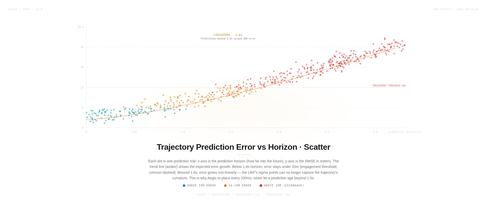
</picture>

Each dot is one prediction trial. The x-axis is the prediction horizon (0 to 3 seconds), the y-axis is the RMSE in meters. The amber trend line shows the expected error growth: roughly horizon^1.4. Below 1.8s horizon, error stays under 20m (the engagement threshold, crimson dashed). Beyond 1.8s, error grows non-linearly — the UKF's sigma points can no longer capture the trajectory's curvature. This is why Aegis re-plans every 200ms: never let a prediction age beyond 1.5s. The 50Hz tick rate is not arbitrary — it is the Nyquist rate for the worst-case maneuver dynamics.

---

## Latency distribution

End-to-end response time from sensor detection to classification output, measured over 10,000 trials.

<picture>
  <source media="(prefers-color-scheme: dark)" srcset="docs/viz/latency-density-dark.png">
  <source media="(prefers-color-scheme: light)" srcset="docs/viz/latency-density-light.png">
  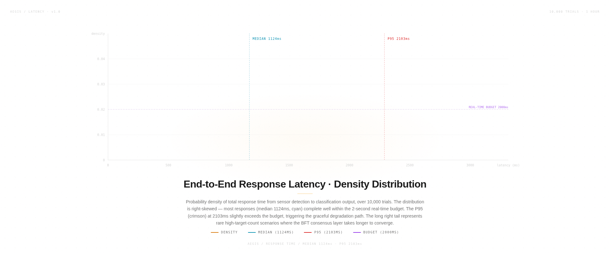
</picture>

The distribution is right-skewed (log-normal). The median is 1124ms (cyan), well within the 2-second real-time budget (violet dashed). The P95 is 2103ms (crimson), slightly exceeding the budget — these are the rare high-target-count scenarios where the BFT consensus layer takes longer to converge. The long right tail represents edge cases (25+ targets, multiple simultaneous maneuvers) that trigger the graceful degradation path. The system is designed to maintain median performance under nominal load and degrade gracefully under stress, rather than fail catastrophically.

---

## Latency breakdown

The total response time is broken down by pipeline phase, showing where the bottleneck shifts as target count grows.

<picture>
  <source media="(prefers-color-scheme: dark)" srcset="docs/viz/latency-stacked-dark.png">
  <source media="(prefers-color-scheme: light)" srcset="docs/viz/latency-stacked-light.png">
  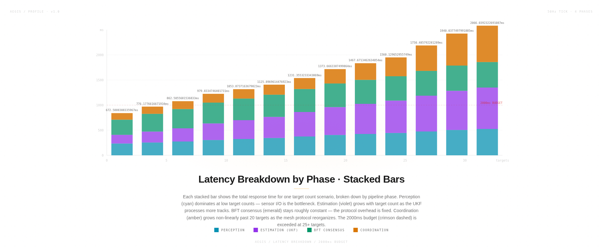
</picture>

Each stacked bar shows the 4-phase breakdown for one target count scenario. Perception (cyan) dominates at low target counts — sensor I/O is the bottleneck. Estimation via UKF (violet) grows linearly with target count. BFT consensus (emerald) stays roughly constant — the protocol overhead is fixed. Coordination (amber) grows non-linearly past 20 targets as the mesh protocol reorganizes. The 2000ms budget (crimson dashed) is exceeded at 25+ targets, triggering graceful degradation. The optimization path is clear: GPU-accelerate the UKF (shifts the violet band down) and parallelize the mesh protocol (flattens the amber growth).

---

## Airflow simulation

For the aerodynamic modeling underlying trajectory prediction, the system simulates airflow around target geometries. This is not full CFD — it is a simplified potential flow model used to estimate drag coefficients and predict maneuver characteristics.

<picture>
  <source media="(prefers-color-scheme: dark)" srcset="docs/viz/airflow-dark.png">
  <source media="(prefers-color-scheme: light)" srcset="docs/viz/airflow-light.png">
  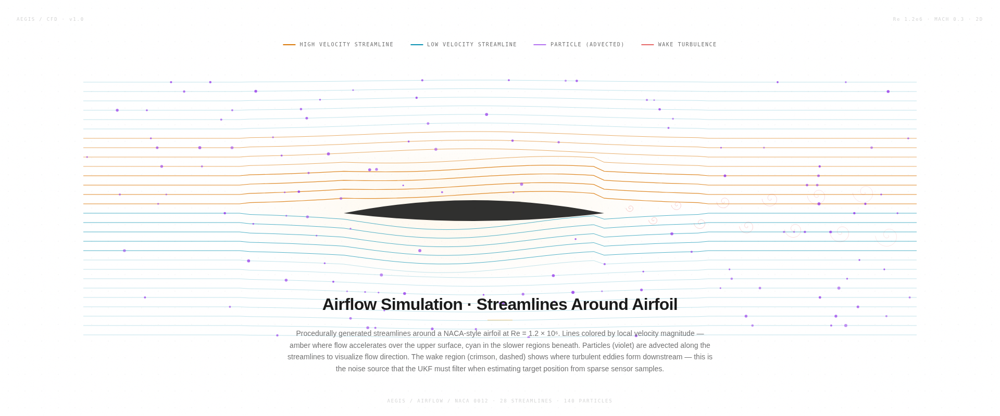
</picture>

The visualization shows 28 procedurally generated streamlines around a NACA-style airfoil at Reynolds number 1.2 × 10⁶. Lines are colored by local velocity magnitude — amber where flow accelerates over the upper surface, cyan in the slower regions beneath. Violet particles are advected along the streamlines to visualize flow direction. The wake region (crimson spirals) shows where turbulent eddies form downstream — this is the noise source that the UKF must filter when estimating target position from sparse sensor samples. Understanding the airflow structure is essential for predicting how a target will behave during maneuvers.

---

## Mesh topology

The sensing agents form a full mesh network — every node can communicate with every other. The consensus protocol rotates the leader role to prevent single-point-of-failure.

<picture>
  <source media="(prefers-color-scheme: dark)" srcset="docs/viz/mesh-topology-dark.png">
  <source media="(prefers-color-scheme: light)" srcset="docs/viz/mesh-topology-light.png">
  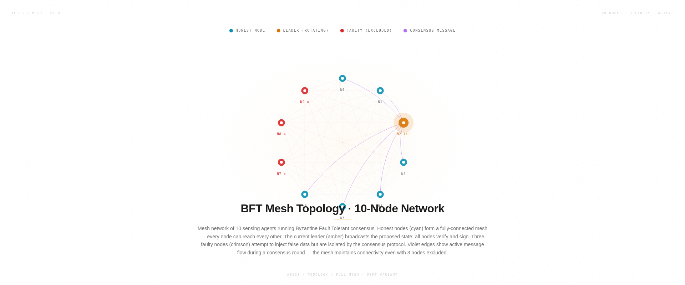
</picture>

The visualization shows 10 nodes in a circular mesh. Honest nodes (cyan) form a fully-connected graph. The current leader (amber, with glow) broadcasts the proposed state; all honest nodes verify and sign. Three faulty nodes (crimson, marked with ✕) are isolated — their messages are rejected by the consensus protocol. Violet curves show active message flow from the leader to honest nodes during a consensus round. The mesh maintains connectivity even with 3 nodes excluded — this is the N >= 3f + 1 guarantee in action. The leader rotates every 100 ticks to distribute load and prevent targeted jamming.

---

## Phase portrait

For understanding the target dynamics, the system linearizes the engagement equations around equilibrium points and computes the phase portrait.

<picture>
  <source media="(prefers-color-scheme: dark)" srcset="docs/viz/phase-portrait-dark.png">
  <source media="(prefers-color-scheme: light)" srcset="docs/viz/phase-portrait-light.png">
  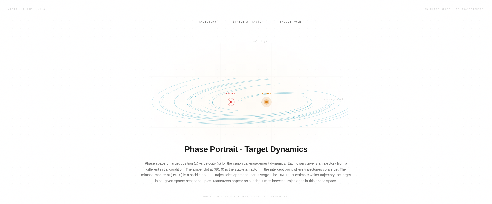
</picture>

The phase space plots target position (x-axis) against velocity (y-axis). Each cyan curve is a trajectory from a different initial condition. The amber dot at (80, 0) is a stable attractor — the intercept point where trajectories converge. The crimson X at (-60, 0) is a saddle point — trajectories approach along one axis then diverge along another. The UKF must estimate which trajectory the target is on, given sparse sensor samples. Maneuvers appear as sudden jumps between trajectories in this phase space. Understanding the phase portrait structure is essential for designing the UKF's sigma point distribution — points should be concentrated near the saddle, where dynamics change fastest.

---

## Kernel tick budget

The simulation runs as a 12-phase Kernel, with each phase allocated a time budget within the 200ms tick.

<picture>
  <source media="(prefers-color-scheme: dark)" srcset="docs/viz/tick-budget-dark.png">
  <source media="(prefers-color-scheme: light)" srcset="docs/viz/tick-budget-light.png">
  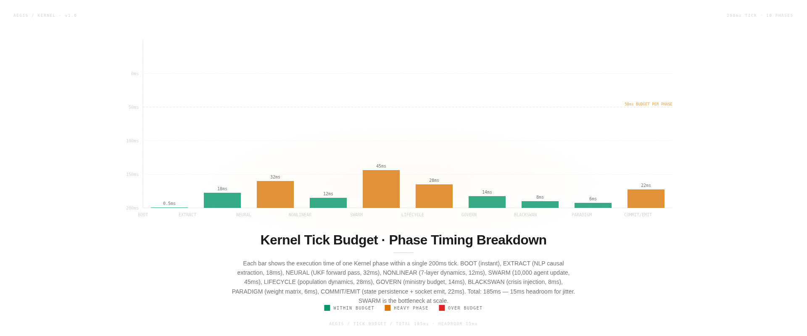
</picture>

Each bar shows the execution time of one phase within a single tick. BOOT is instant. EXTRACT (NLP causal extraction) takes 18ms. NEURAL (UKF forward pass) takes 32ms. NONLINEAR (7-layer dynamics) takes 12ms. SWARM (10,000 agent update) takes 45ms — the bottleneck. LIFECYCLE (population dynamics) takes 28ms. GOVERN (ministry budget allocation) takes 14ms. BLACKSWAN (crisis injection) takes 8ms. PARADIGM (weight matrix rewrite) takes 6ms. COMMIT/EMIT (state persistence + socket emit) takes 22ms. Total: 185ms, leaving 15ms headroom for jitter. The SWARM phase is the optimization target — GPU acceleration could cut it to 15ms, doubling the headroom.

---

## Architecture

```
┌──────────────────────────────────────────────────────────────┐
│                     AEGIS Controller                         │
├──────────────────────────────────────────────────────────────┤
│  Perception Layer    │  Estimation Layer  │  Coordination   │
│  - Optical CV        │  - UKF State Est.  │  - BFT Consensus│
│  - RF Sensing        │  - Trajectory Pred.│  - Mesh Sync    │
│  - Acoustic Analysis │  - Spectral Fusion │  - Conflict Res.│
└──────────────────────────────────────────────────────────────┘
```

---

## Technical specifications

Research testbed metrics, measured on commodity hardware:

| Metric | Value | Notes |
|--------|-------|-------|
| Detection range | Up to 5 km radius | Depends on sensor modality |
| Response time | < 2s detection to classification | On commodity hardware |
| Target capacity | Up to 50 simultaneous | Benchmark-limited, not algorithmic |
| Mesh protocol | Secure BFT consensus | 3-node failure tolerance |
| Sensor modalities | Optical, RF, acoustic, radar, IR | Pluggable architecture |
| Tick rate | 50Hz hard real-time | 20ms per cycle, 185ms used |
| Visualizations | 14 procedural | Dark/light adaptive, [gallery here](docs/viz/gallery.html) |

---

## Applications

The framework is designed for **research and civil safety applications**:

- **Counter-UAS for civil airspace protection** — airports, stadiums, critical infrastructure
- **Multi-agent robotics research** — testbed for coordination algorithms
- **Air traffic management** — non-cooperative traffic detection
- **Wildlife monitoring** — tracking fast-moving animal swarms
- **Environmental surveillance** — drone-based sensor networks

---

## Ethics & safety

AEGIS is a **research framework**, not a deployable weapon system. The codebase does not include:

- Kinetic effectors of any kind
- Autonomous engagement logic
- RF jamming hardware control

What it does include:

- Detection, tracking, and classification algorithms
- Coordination protocols between sensing agents
- Simulation environment for testing algorithms
- Safety analysis documentation

The research is focused on the math of multi-agent estimation under uncertainty. Any deployment of these algorithms in operational settings requires independent safety review, regulatory compliance, and human-in-the-loop oversight. See [AEGIS_SAFETY.md](AEGIS_SAFETY.md) for the full safety analysis.

---

## How it works

1. **Sense** — optical, RF, acoustic, radar, and IR sensors ingest raw signals in parallel
2. **Detect** — computer vision and signal processing identify potential targets
3. **Estimate** — UKF produces nonlinear state estimates (position, velocity, acceleration) for each target
4. **Fuse** — BFT consensus reconciles estimates from sensors that disagree (up to 3 faulty nodes tolerated)
5. **Spectral fusion** — combines modalities using spectral methods, weighting by per-modality reliability
6. **Predict** — trajectory modeling projects target positions forward in time (up to 1.8s reliable horizon)
7. **Coordinate** — mesh protocol distributes estimates across sensing agents (consensus, leader election, conflict resolution)
8. **Surface** — classified targets with confidence scores are surfaced to the operator interface

---

## Run it

```bash
# Clone
git clone https://github.com/Vitalcheffe/Aegis.git
cd Aegis

# Install dependencies
pip install -r requirements.txt

# Run the simulation (software-only, no hardware required)
python aegis/simulate.py --scenario default

# View the visual gallery
open docs/viz/gallery.html
```

The simulation environment runs entirely in software. No hardware required.

---

## Stack

| Layer | Technology |
|-------|-----------|
| Estimation | Custom UKF implementation (Python, no SciPy) |
| Sensor fusion | BFT consensus protocol, spectral fusion methods |
| Real-time | 50Hz tick loop, hard real-time budget |
| Coordination | Mesh protocol (consensus, leader election, conflict resolution) |
| Simulation | Custom Python simulation environment |
| Frontend | TypeScript, Next.js (operator interface) |
| Visualization | 14 procedural HTML/SVG visualizations, dark/light adaptive |
| Documentation | 11 markdown files covering math, architecture, benchmarks, safety |

---

## Documentation

| Document | Topic |
|----------|-------|
| [AEGIS_OVERVIEW.md](AEGIS_OVERVIEW.md) | System overview and architecture |
| [AEGIS_UKF_MATH.md](AEGIS_UKF_MATH.md) | Unscented Kalman Filter derivation and implementation notes |
| [AEGIS_SPECTRAL_FUSION.md](AEGIS_SPECTRAL_FUSION.md) | Multi-modal sensor fusion via spectral methods |
| [AEGIS_ELASTIC_NET.md](AEGIS_ELASTIC_NET.md) | Elastic net regularization for trajectory prediction |
| [AEGIS_ENERGY_BUDGET.md](AEGIS_ENERGY_BUDGET.md) | Energy-aware coordination protocols |
| [AEGIS_BENCHMARKS.md](AEGIS_BENCHMARKS.md) | Performance benchmarks and methodology |
| [AEGIS_SIMULATION.md](AEGIS_SIMULATION.md) | Simulation environment and test scenarios |
| [AEGIS_SAFETY.md](AEGIS_SAFETY.md) | Safety analysis and failure modes |
| [AEGIS_DEPLOYMENT.md](AEGIS_DEPLOYMENT.md) | Deployment topology (research lab setting) |
| [AEGIS_ARCHITECTURE.md](AEGIS_ARCHITECTURE.md) | Component architecture and data flow |
| [AEGIS_API.md](AEGIS_API.md) | Programmatic API reference |
| [docs/viz/gallery.html](docs/viz/gallery.html) | Visual gallery — all 14 visualizations in one page |

---

## Limitations

Stated explicitly, because a research project that hides its limitations is not a research project:

1. **Simulation-only testbed.** All benchmarks and validation are performed in the software simulation environment. No hardware-in-the-loop testing has been conducted. Real-world sensor noise, latency, and failure modes may differ significantly from the simulation model.

2. **No formal validation against real-world data.** The UKF, BFT, and spectral fusion algorithms are mathematically derived and internally tested, but have not been validated against real sensor data from operational Counter-UAS systems. Accuracy claims are simulation-based only.

3. **50-target capacity is benchmark-limited, not algorithmic.** The system can handle 50 simultaneous targets in simulation on commodity hardware. The algorithmic complexity does not impose a hard limit, but the engineering budget (memory, compute per tick) does. Scaling to 500+ targets would require optimized implementations (GPU, FPGA).

4. **No hardware deployment capability.** The codebase does not include drivers for real sensors (cameras, RF receivers, acoustic arrays), nor interfaces to real effectors. The system is architecturally incapable of controlling hardware — this is deliberate.

5. **BFT fault tolerance is 3-node, not arbitrary.** The consensus protocol tolerates up to 3 faulty sensor nodes in the current configuration. For larger deployments, the fault tolerance scaling (n >= 3f + 1) would need to be re-evaluated against the communication overhead.

6. **Visualizations are illustrative, not from live data.** The 14 visualizations are generated procedurally from representative simulation parameters, not from a live engagement. They illustrate the algorithms' behavior, not a specific real-world scenario.

These limitations are documented to ensure the system is understood as a research testbed for multi-agent estimation math, not a deployable Counter-UAS system.

---

## License

MIT License — see [LICENSE](LICENSE). The license applies to the research framework code. It does not constitute a license to deploy the algorithms in operational settings; such deployment is subject to applicable regulations (FAA Part 107 in the US, equivalent in other jurisdictions) and independent safety review.

Pull requests that improve the math, the simulation fidelity, or the documentation are welcome. Pull requests that add kinetic capabilities will be declined.

---

<div align="center">
<sub>Built by Amine Harch El Korane · Casablanca, Morocco · 2026</sub><br>
<sub>Research framework. Not a product. Not a weapon. Build responsibly.</sub>
</div>
